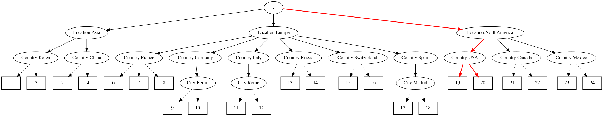
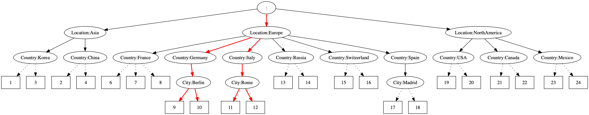

# Netmap Query Language

**SELECT 1 Country FILTER Location NE Asia**


**SELECT 2 City FILTER Location EQ Europe**


## Description
This is REPL for interacting with netmap with QueryLanguage in NEOFS and applying placement rules to it.
Netmap and CRUSH enchacement with FILTERs is described in research plan.

## Commands
To see help for specific command type `command help`.

### help
`help`

Get a list of commands.

### exit
`exit`

Exit program.

### load
`load <filename>`

Load netmap from specified file.

### save
`save <filename>`

Save netmap to specified file.

### clear
`clear`

Clear current netmap.

### query
`query <STATEMENT>`

SELECT Example:

```
>>> add 1 /Location:Europe/Country:Germany
>>> add 2 /Location:Europe/Country:Austria
>>> add 3 /Location:Asia/Country:Korea
>>> add 4 /Location:Asia/Country:Japan
>>> query SELECT 1 Location
>>> query SELECT 2 Country
```

FILTER Example

Operation can be one of EQ, NE, LT, LE, GT, GE:

```
>>> add 1 /Location:Europe/Country:Germany
>>> add 2 /Location:Europe/Country:Austria
>>> query SELECT 1 Country FILTER Country NE Austria
```


### get-selection
`get-selection`

Get nodes from current selection.

Example:
```
>>> load /examples/map2
>>> query SELECT 1 Country FILTER Location NE Asia
>>> get-selection
[13 14]
```

### clear-selection
`clear-selection`

Clear current selection.

### dump-selection
`dump-selection <filename>`

Dump netmap in graphical format. If using docker, `/pics` directory is mounted as `temp` on host.

